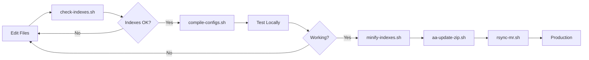

# Build Tools and Scripts

## Overview

Mawrid Reader includes several shell scripts that automate common development, build, and deployment tasks. These scripts handle everything from validating data integrity to creating distribution packages.

## Script Organization

Scripts are organized in two locations:
- **Root directory**: Primary development scripts
- **Attic/ directory**: Utility and maintenance scripts

The Attic directory contains scripts that are less frequently used or are specific to production/deployment workflows.

## Script Reference

### 1. check-indexes.sh

**Location**: `/check-indexes.sh`  
**Purpose**: Validates that dictionary indexes are properly sorted alphabetically

**Usage**:
```bash
./check-indexes.sh
```

**What it does**:
1. Extracts index arrays from all `mr-??-indexes.js` files
2. Compares each index's original order with alphabetically sorted order
3. Reports any entries that are out of order
4. Creates temporary files in `/tmp/mr-index-checks/` for comparison

**When to use**: 
- After manually creating or editing index files
- Before committing changes to index files
- As part of quality assurance checks

**Example output**:
```
Comparison for index: mr-aa-indexes.js: <<< ll >>>
=======================================
Index of 1435 lines looks well sorted and OK!! :)
```

### 2. compile-configs.sh

**Location**: `/Attic/compile-configs.sh` (referenced but may be in root)  
**Purpose**: Compiles individual configuration files into a single file

**Usage**:
```bash
./Attic/compile-configs.sh
```

**What it does**:
1. Reads individual configuration files:
   - `mr-aa-conf.js` (Arabic Almanac)
   - `mr-mr-conf.js` (Mawrid)
   - `mr-mh-conf.js` (Mabhath ul Talib)
2. Combines them into `mawrid-configs.js`
3. Creates a unified configuration that can be switched via URL parameters

**When to use**:
- After adding or modifying dictionary configurations
- Before testing configuration changes
- As part of the build process

### 3. minify-indexes.sh

**Location**: `/Attic/minify-indexes.sh`  
**Purpose**: Minifies index files to reduce file size for production

**Usage**:
```bash
cd Attic
./minify-indexes.sh
```

**What it does**:
1. Uses `minify.pl` Perl script to compress JavaScript
2. Creates minified versions of index files:
   - `mr-aa-indexes.js` → `mr-aa-indexes.min.js`
   - `mr-mr-indexes.js` → `mr-mr-indexes.min.js`
3. Removes unnecessary whitespace and comments

**When to use**:
- Before deploying to production
- When optimizing load times
- After finalizing index changes

**Dependencies**: Requires `minify.pl` script in the same directory

### 4. aa-update-zip.sh

**Location**: `/Attic/aa-update-zip.sh`  
**Purpose**: Creates a distribution ZIP file for offline use

**Usage**:
```bash
cd Attic
./aa-update-zip.sh
```

**What it does**:
1. Extracts version number from `aa/mawrid-app.js`
2. Creates ZIP file named `Mawrid_Reader_v{version}.zip`
3. Includes necessary files:
   - HTML files
   - JavaScript files
   - Icon files
   - Library files (jslib/)
   - Text content (text/*)
   - .nomedia files
4. Excludes swap files (*.swp)
5. Lists included HTML/JS files and shows final ZIP size

**When to use**:
- Creating releases for distribution
- Preparing offline packages
- Archiving stable versions

**Example output**:
```
updating: aa/index.html (stored 0%)
updating: aa/mawrid-app.js (deflated 75%)
...
-rw-r--r-- 1 user group 2.5M Jan 15 10:30 Mawrid_Reader_v4.0.zip
```

### 5. rsync-mr.sh

**Location**: `/Attic/rsync-mr.sh`  
**Purpose**: Synchronizes files to production server (deployment)

**Note**: Content not shown in repository, but typically would:
- Use rsync to upload files to web server
- Exclude development files
- Preserve permissions and timestamps
- Show transfer progress

**When to use**:
- Deploying updates to production server
- Synchronizing changes to staging environment

### 6. update-readme-html.sh

**Location**: `/Attic/update-readme-html.sh`  
**Purpose**: Converts README documentation to HTML format

**What it likely does**:
- Converts README.rst or README.md to readme.html
- Applies formatting and styling
- Makes documentation viewable in browser

**When to use**:
- After updating README documentation
- Before releases to ensure HTML version is current

## Typical Workflows

### Adding a New Dictionary

1. Create index file and configuration
2. Run `check-indexes.sh` to verify index sorting
3. Run `compile-configs.sh` to build unified configuration
4. Test in browser
5. Run `minify-indexes.sh` for production
6. Create release with `aa-update-zip.sh`

### Preparing for Production

```bash
# 1. Verify all indexes are properly sorted
./check-indexes.sh

# 2. Compile configurations
./Attic/compile-configs.sh

# 3. Minify indexes
cd Attic && ./minify-indexes.sh && cd ..

# 4. Create distribution package
cd Attic && ./aa-update-zip.sh && cd ..

# 5. Deploy to server (if configured)
./Attic/rsync-mr.sh
```

### Development to Production Pipeline



## Best Practices

1. **Always validate before building**: Run `check-indexes.sh` before compilation
2. **Test locally first**: Ensure changes work before minifying
3. **Version control**: Commit source files before running build scripts
4. **Backup before deployment**: Keep previous versions of ZIP files
5. **Document changes**: Update version numbers and changelogs

## Troubleshooting

### Script Permission Errors
```bash
chmod +x script-name.sh
```

### Scripts Not Found
Ensure you're in the correct directory. Some scripts are in `Attic/`

### Minification Fails
Check that `minify.pl` exists and has proper permissions

### ZIP Creation Fails
Ensure all referenced directories (aa/, mr/, mh/) exist

## Future Improvements

Consider modernizing the build process with:
- npm scripts or Makefile
- Automated testing before build
- Continuous integration
- Automated version bumping
- Error handling in scripts