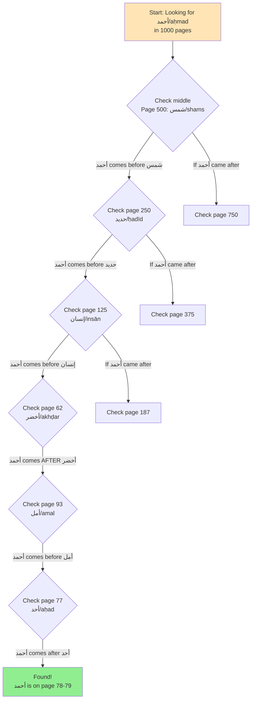

# Search System Deep Dive

## Overview

The search system is the heart of Mawrid Reader, enabling users to find Arabic words across multiple scanned dictionaries. It employs different algorithms based on dictionary type and includes sophisticated transliteration and suggestion systems.

## Search Algorithms

### 1. Binary Search (for Sorted Dictionaries)

Used for dictionaries with alphabetically sorted entries.

```javascript
function binarySearch(searchfor, index){
    var minIndex = 0;
    var maxIndex = index.length - 1;
    var currentIndex;
    var currentElement;
 
    while (minIndex <= maxIndex) {
        currentIndex = (minIndex + maxIndex) / 2 | 0;
        currentElement = index[currentIndex];
 
        if (currentElement < searchfor) {
            minIndex = currentIndex + 1;
        }
        else if (currentElement > searchfor) {
            maxIndex = currentIndex - 1;
        }
        else {
            // Found exact match - trace back to first occurrence
            while (currentIndex > 0 && index[currentIndex - 1] == searchfor) {
                currentIndex--;
            }
            return currentIndex;
        }
    }
    return maxIndex;
}
```

**How it works:**
1. Starts with the middle of the index
2. Compares search term with middle element
3. Narrows search to upper or lower half
4. Repeats until found or exhausted
5. Returns page containing the word

**Example:**
- Searching for "كتاب" in a 1000-page dictionary
- Checks page 500, finds "صبر" (later in alphabet)
- Checks page 250, finds "حمد" (still later)  
- Checks page 625, finds "قلم" (earlier)
- Continues until finding "كتاب" on page 583

### 2. Plain Search (for Non-Alphabetical Dictionaries)

Used for dictionaries not sorted alphabetically (e.g., organized by topic).

```javascript
function plainSearch(searchfor, index, match_firstlast_word) {
    var searchfor_regex;
    
    if (match_firstlast_word == 'beg') {
        // Match beginning of entry
        searchfor_regex = new RegExp('^' + searchfor);
    } else if (match_firstlast_word == 'end') {
        // Match end of entry
        searchfor_regex = new RegExp(searchfor + '$');
    } else {
        // Match anywhere
        searchfor_regex = new RegExp('\\b' + searchfor + '\\b');
    }
    
    // Search through index
    for (var i = 0; i < index.length; i++) {
        if (searchfor_regex.test(index[i])) {
            return i; // Return page number
        }
    }
    
    return -1; // Not found
}
```

**Features:**
- Regex-based pattern matching
- Can match at beginning, end, or anywhere
- Returns first match found
- Used for specialized dictionaries

## Search Flow

### 1. Input Processing

```javascript
function do_search(str) {
    // Normalize input
    searched_word = str.trim();
    
    // Apply transliteration
    searched_word = searched_word.replace(/th/g,"ث");
    searched_word = searched_word.replace(/gh/g,"غ");
    searched_word = searched_word.replace(/kh/g,"خ");
    // ... more transliterations
    
    // Normalize Arabic
    searched_word = searched_word.replace(/[أإآ]/g,"ا");
    
    // Search each dictionary
    for (var book in books) {
        if (!books[book]["should_hide"]) {
            performSearch(book, searched_word);
        }
    }
}
```

### 2. Multi-Dictionary Search

The system searches all selected dictionaries in parallel:

```javascript
// For each selected dictionary
books.forEach(book => {
    if (book.type === 'sorted') {
        page = binarySearch(searchTerm, book.index);
    } else {
        page = plainSearch(searchTerm, book.index);
    }
    
    // Update display
    displayPage(book, page);
});
```

## Suggestion System

### 1. Yamli-like Variations

Creates alternative spellings based on common confusions:

```javascript
var yamli_like_opts = {
    'ا': 'اوي', 'و': 'ويا', 'ي': 'يوا',
    'ب': 'بن', 'ن': 'نبت', 'ت': 'تنب',
    // ... more mappings
};

function make_suggestions(root) {
    var suggestions = [root];
    
    // Generate variations
    for (var i = 0; i < root.length; i++) {
        var letter = root[i];
        if (yamli_like_opts[letter]) {
            // Create variations with alternative letters
            var alternatives = yamli_like_opts[letter];
            // Add each variation to suggestions
        }
    }
    
    return suggestions;
}
```

### 2. Autocomplete

Provides real-time suggestions as user types:

```javascript
function suggest_completions(typed, callback) {
    // Get variations
    var suggestions = make_suggestions(typed);
    
    // Filter against actual roots
    var filtered = all_roots.filter(root => {
        return suggestions.some(s => root.startsWith(s));
    });
    
    // Format for display
    var response = filtered.map(root => ({
        value: root,
        label: highlightMatch(root, typed)
    }));
    
    callback(response);
}
```

## Search Optimizations

### 1. Index Preloading
All indexes loaded at startup for instant search.

### 2. Result Caching
Recent searches cached to avoid recomputation.

### 3. Early Termination
Search stops after finding sufficient matches.

### 4. Normalized Comparisons
Arabic text normalized before comparison to handle variants.

## Special Features

### 1. Root Extraction
For dictionaries organized by roots:
- Extracts root from derived words
- Searches for root in root-based index

### 2. Proximity Search
For multi-volume dictionaries:
- Searches current volume first
- Expands to nearby volumes if needed

### 3. Cross-Reference Support
Some dictionaries reference others:
- Detects cross-references
- Optionally searches referenced dictionary

## Example Search Walkthrough

**User searches for "مكتبة" (library):**

1. **Input**: User types "maktaba" or "مكتبة"
2. **Transliteration**: "maktaba" → "مكتبة"
3. **Normalization**: Handle alif variations
4. **Root Extraction**: Identify root "كتب"
5. **Binary Search**: Find "كتب" in index
6. **Page Mapping**: Root found at index 583 → page 583
7. **Display**: Load image ../aa-data/img/hans/500/583.png
8. **Navigation**: Enable next/previous page buttons

## Performance Characteristics

- **Binary Search**: O(log n) - very fast even for large dictionaries
- **Plain Search**: O(n) - slower but necessary for unsorted content  
- **Suggestions**: O(m×n) where m = variations, n = dictionary size
- **Overall**: Most searches complete in < 100ms

## How Binary Search Works - A Simple Explanation

### The Problem: Searching Scanned Books

Imagine you have a 1,000-page Arabic dictionary that has been scanned as images (like photos of each page). These are just pictures - your computer cannot "read" the text in them. Normally, to search these images, you would need OCR (Optical Character Recognition) software to convert the images into actual text, which is complex and often inaccurate for Arabic script.

### The Clever Solution: Pre-built Indexes

Mawrid Reader uses a brilliant workaround. Someone has manually created an "index" - essentially a list that records the last word appearing on each page of the dictionary.

This index looks like this:

```javascript
var dictionary_index = [
    "",           // Page 0 (unused)
    "آب",         // Page 1 ends with آب (āb) - "August/father"
    "أبد",        // Page 2 ends with أبد (abad) - "eternity"
    "أتى",        // Page 3 ends with أتى (atā) - "he came"
    "أثر",        // Page 4 ends with أثر (athar) - "trace/effect"
    "أحمد",       // Page 5 ends with أحمد (aḥmad) - "Ahmad (name)"
    // ... continues for all 1,000 pages
];
```

### Understanding Binary Search

Binary search is like playing an efficient guessing game. If someone thinks of a number between 1 and 1,000, the smart strategy is:

1. Start in the middle (500)
2. Ask "is it higher or lower?"
3. If higher, check 750 (middle of 500-1,000)
4. If lower, check 250 (middle of 1-500)
5. Keep halving the range until you find it

This finds any number in at most 10 guesses! (Because 2^10 = 1,024)



### Binary Search with Arabic Words

Let's trace through a real example. Suppose you search for the word أحمد (aḥmad):

1. **Start at the middle** (page 500)
   - Index shows page 500 ends with شمس (shams) - "sun"
   - Compare: أحمد (aḥmad) comes before شمس (shams) alphabetically

2. **Look in first half** (page 250)
   - Index shows page 250 ends with حديد (ḥadīd) - "iron"
   - Compare: أحمد (aḥmad) comes before حديد (ḥadīd)

3. **Look earlier** (page 125)
   - Index shows page 125 ends with إنسان (insān) - "human"
   - Compare: أحمد (aḥmad) comes before إنسان (insān)

4. **Look earlier** (page 62)
   - Index shows page 62 ends with أخضر (akhḍar) - "green"
   - Compare: أحمد (aḥmad) comes after أخضر (akhḍar)

5. **Look between 62-125** (page 93)
   - Index shows page 93 ends with أمل (amal) - "hope"
   - Compare: أحمد (aḥmad) comes before أمل (amal)

6. **Look between 62-93** (page 77)
   - Index shows page 77 ends with أحد (aḥad) - "one"
   - Compare: أحمد (aḥmad) comes after أحد (aḥad)

7. **Found it!** The word أحمد (aḥmad) must be on page 78 or 79

### Why This Is Brilliant

- **No OCR Required**: We never needed to convert images to text
- **Lightning Fast**: Found the right page in just 7 checks out of 1,000 pages
- **Works with Images**: Once we know it's page 78, we simply display `page78.png`
- **Simple Data Structure**: Just an array mapping page numbers to last words

Instead of the complex task of teaching a computer to read Arabic text in scanned images, the system uses a simple "phone book" approach - a pre-built index that tells you exactly which page each word is on!

## Error Handling

1. **Not Found**: Shows nearest matches
2. **Invalid Input**: Sanitized and processed anyway
3. **Missing Index**: Gracefully skips dictionary
4. **Image Load Failure**: Shows error message